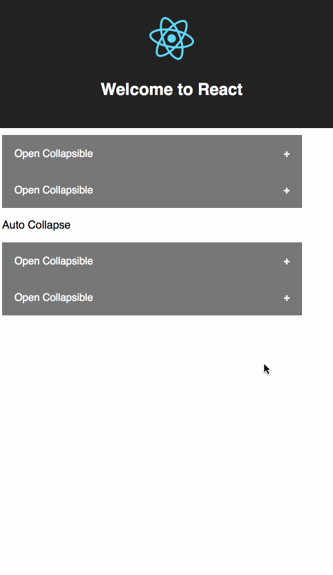

# React Collapse

## Demo

## Note

key point:

1. use css transition to implement the animation

        .collapse-body {
          width: 100%;

          padding: 0 18px;
          overflow: hidden;
          background-color: #f1f1f1;

          max-height: 0;
          transition: max-height 0.2s ease-out;
        }

1. change max-height value dynamically, get collapsed element height by scrollHeight property

        
 this._collapse_body=ref}>
             ...
        

        clickHead = () => {
          this.setState({active: !this.state.active})
          if (!this.state.active) {
            this.setState({maxHeight: this._collapse_body.scrollHeight + 'px'})
          } else {
            this.setState({maxHeight: '0px'})
          }
        }
